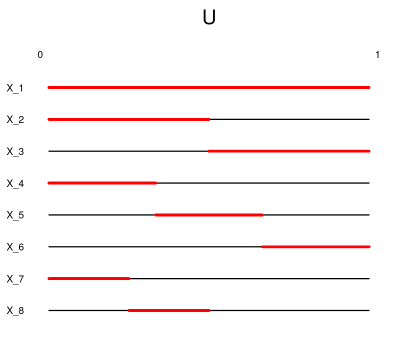
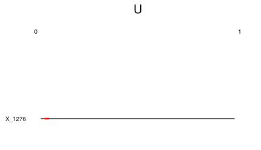

# Visualizing Weak vs. Almost Sure Convergence

By definition, a sequence of random variables $X_n$ converges to $X$ in probability if:

$$lim_{n \rightarrow \infty} P(|X_n - X| > \epsilon) = 0$$

The sequence converges to $X$ almost surely if:

$$
P(\omega \in \Omega | lim_{n \rightarrow \infty} X_n(\omega) = X(\omega)) = 1
$$

or equivalently:

$$
P(\omega \in \Omega | lim_{n \rightarrow \infty} X_n(\omega) \neq X(\omega)) = 0
$$

These statements look somewhat similar at first glance, but they are describing different notions of what it means for a sequence of random variables to converge.  Here we look at a particular sequence of random variables $X_n$ that converges in probability but not almost surely, and use a visualization to build some intuition for what each of these definitions really means.

# An Example Sequence $X_n$ 

Let $U \sim Uniform(0, 1)$, and define the sequence of random variables $X_n$ like so:

$X_1 = U + I_{[0, 1]}(U)$

$X_2 = U + I_{[0, \frac{1}{2})}(U)$

$X_3 = U + I_{[\frac{1}{2}, 1]}(U)$

$X_4 = U + I_{[0, \frac{1}{3})}(U)$

$X_5 = U + I_{[\frac{1}{3}, \frac{2}{3})}(U)$

$X_6 = U + I_{(\frac{2}{3}, 1]}(U)$

$X_7 = U + I_{[0, \frac{1}{4})}(U)$

...

For $n \in \mathbb{N}$, where $I_A(U)$ is the indicator function that takes value $1$ when $U \in A$ and $0$ otherwise.  What is this sequence doing?  We can see that for any fixed value of $u$, the sequence will oscillate between $u$ and $u + 1$, jumping upwards by 1 at all values of $n$ for which $u$ "turns on" the indicator function associated with $X_n$.  We might describe the behavior of $X_n$ by saying that as it moves forward in $n$ it is scanning over the unit interval from left to right over and over again and "looking" for $u$.  The plot below shows the values of $X_n$ for $n=1,2, ..., 50$ for $u = \frac{\pi}{4}$.

Notice the following two properties of the sequence $X_n$ that we've constructed:

- 1) **The sequence finds any value of $u$ less and less frequently as n increases**

As it progresses, the sequence uses a finer and finer window with which to scan over the unit interval.  Therefore, each scan will take longer (in terms of number of elements of the sequence) and $u$ will still only be found once per scan.

- 2) **The sequences always eventually finds any $u$ again - it therefore finds $u$ "infinitely often"**

Even though the sequence finds $u$ less and less frequently, each scan that it makes covers the entire unit interval.  Therefore it will always find $u$ again, even though it will take longer and longer to do so.  We can say that $X_n$ finds $u$ "infinitely often" in the sense that there does not exist a large enough $n^*$ such that $X_n$ doesn't find $u$ for all $n > n^*$.

# Visualizing the Relationship Between $X_n$ and $U$

We can visualize what $X_n$ is doing in relation to $U$ by building a table (of sorts) with elements of $X_n$ as the rows and possible values of $U$ as the "columns."  Since $U$ takes an uncountable number of values, the "column" values for each row will just be the unit interval.  On each of these  intervals we highlight in red the region for which $X_n$ "finds" $U$, which is the region where $X_n \neq U$ and thus $X_n - U = 1$. This visualization nicely illustrates $X_n$'s behavior of continuously "scanning" across the unit interval with a progressively smaller window.  

# $X_n$ Converges to $U$ in Probability

Since $U$ is uniformly distributed over the interval, for each $X_n$ we have that $P(X_n \neq U)$ is just the length of the red bar in $X_n$'s corresponding row.  Clearly $P(X_n \neq U)$ is decreasing in $n$ - consider the row in our table corresponding to $X_{1276}$:

The row corresponding to $X_{10^8}$ would have a red bar so small as to be practically invisible.  The property of $X_n$ that $P(X_n \neq U)$ is decreasing in $n$ corresponds to the first property we noticed about the deterministic sequence $X_n(u)$.  Since $lim_{n \rightarrow \infty} P(X_n \neq U) = 0$ then clearly $lim_{n \rightarrow \infty} P(|X_n - U| < \epsilon) = 0$ for any $\epsilon$ and therefore $X_n$ converges to $U$ in probability.  In our visualization, as we go very far down in our table and choose rows corresponding to high values of $n$, the red bar becomes vanishingly small.

# $X_n$ Does Not Converge to $U$ Almost Surely

Now let's look at columns in our table instead of rows.  Suppose we choose a specific $u$ and draw an infinite vertical line through all of the $X_n$ row intervals in our table at $U=u$.  We see that we will intersect an infinite number of red bars, or in other words there are an infinite number of elements of $X_n$ for which $X_n(u) \neq U$.  This is the second property we mentioned above.

Since this holds for any choice of $u$, it must be that for every $u$ there are an infinite number of terms of $X_n$ for which $X_n(u) \neq U$ and thus $X_n(u) - U = 1$.  Since the set of these "badly behaved" $u$ values for which $lim_{n \rightarrow \infty} X_n(u) \neq u$ is the entire unit interval, then the probability of this set is 1 (it is the entire support of $U$).  By definition this means that $X_n$ does **not** converge almost surely to $U$.

We can equivalently state this in terms of the "infinitely often" notion we described above.  Notice that saying that $lim_{n \rightarrow \infty} X_n(u) \neq u$ is equivalent to saying that $X_n(u) \neq u$ an infinite number of times, since if this event instead happens a finite number of times we could find the final time it happens $X_k$ and observe that it never happens again afterwards.  Using set notation, we can thus express our "badly behaved" $u$ values as the set of $u$'s such that "we cannot find a value of $k \in \mathbb{N}$ for which this event never happens for $n \geq k$":

$$
\cap_{k=1}^\infty \cup_{n \geq k} \{u | X_n(u) \neq u \} = (0, 1)
$$

Almost sure convergence can therefore also be defined by measuring the size of this set:

$$
X_n \rightarrow^{a.s.} U \iff P(\cap_{k=1}^\infty \cup_{n \geq k} \{u | X_n(u) \neq u \}) = 0
$$

In our visualization, we notice that we can start drawing our vertical lines downward from any row $k$ and each line will still intersect an infinite number of red bars.

# Almost Sure Convergence Implies Convergence in Probability

Our table can be a useful way to "visually prove" this using a contrapositive argument.  Suppose that we had constructed $X_n$ in such a way where for every row in our table, there was a large (i.e. not measure zero) set of $u$ values covered by a red bar.  Then these intervals would have to overlap with each other an infinite number of times for some large set of $u$'s.  At each $u$ in this second set we could draw a vertical line that intersected an infinite number of red bars!

# Conclusion

Convergence in probability is concerned with what happens at *specific* elements in the tail of the sequence, which we considered in our visualization by examining rows very far down in our table.  Almost sure convergence, on the other hand, is concerned with what happens for given events *across* elements in the tail of our sequence.  We explored this by considering looking at columns $u$ in our table for which the deterministic sequences $X_n(u)$ did not converge.  We only needed one table here, as for our sequence $X_n(u) \neq u \rightarrow |X_n - U| = 1 > \epsilon \; \forall \epsilon \in (0, 1)$.  If we were to generalize our visualization strategy, we would need a different table for each $\epsilon > 0$.

# References

Casella, G. and R. L. Berger (2002): Statistical Inference, Duxbury.

